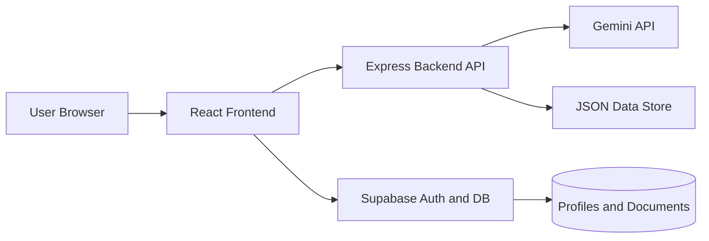

<p align="center">
	
</p>

<p align="center">
	
</p>

<p align="center">
	
	
	
	
</p>

## Overview

Healthcare Hub is a full-stack healthcare mini platform built to make medical discovery and appointment workflows simple, fast, and user-friendly.

It combines:

- A React frontend for search, details, and booking flows
- An Express backend for healthcare APIs, favorites, and appointment storage
- Supabase for authentication, profile management, and protected data access
- Gemini integration for AI-based conversational assistance

## Core Features

- Secure user authentication and profile onboarding
- Nearby hospital discovery with location-aware search
- Hospital detail view with enriched healthcare information
- Appointment creation, listing, and cancellation
- Favorite hospitals management per user
- AI health assistant endpoint using Gemini
- Row-Level Security (RLS) based data protection in Supabase

## Tech Stack

- Frontend: React, Vite, Axios, Leaflet
- Backend: Node.js, Express, CORS, Dotenv
- AI: Google Generative AI (Gemini)
- Database/Auth: Supabase (Auth, SQL, RLS, Storage)
- Tooling: Nodemon, Concurrently

## Project Structure

```text
Mini-Project-main/
|- backend/
|  |- data/
|  |  |- appointments.json
|  |  |- hospital-favorites.json
|  |- db/
|  |  |- schema.sql
|  |  |- migrations/
|  |- utils/
|  |  |- appointments-store.js
|  |  |- favorites-store.js
|  |  |- healthcare.js
|  |- server.js
|  |- package.json
|- config/
|- database/
|  |- schema.sql
|- frontend-react/
|  |- src/
|  |  |- components/
|  |  |- styles/
|  |  |- utils/
|  |- package.json
|- package.json
|- README.md
```

## Architecture



## API Highlights

| Method | Endpoint | Purpose |
|---|---|---|
| GET | /api/health | Health check |
| POST | /api/chat | AI chat response from Gemini |
| GET | /api/hospitals/nearby | Discover hospitals by location/query |
| GET | /api/hospitals/detail | Fetch enriched hospital details |
| GET | /api/services/search | Search healthcare services |
| GET | /api/places/nearby | Resolve nearby places/cities |
| GET | /api/appointments | List user appointments |
| POST | /api/appointments | Create appointment |
| DELETE | /api/appointments/:appointmentId | Delete appointment |
| GET | /api/favorites | List favorite hospitals |
| POST | /api/favorites | Add favorite hospital |
| DELETE | /api/favorites/:favoriteId | Remove favorite hospital |

## Quick Start

### 1. Prerequisites

- Node.js 18+
- npm 9+
- Supabase project
- Gemini API key

### 2. Clone Repository

```bash
git clone https://github.com/rish0000-dot/Mini-Project.git
cd Mini-Project/Mini-Project-main
```

### 3. Install Dependencies

```bash
npm install
npm --prefix backend install
npm --prefix frontend-react install
```

### 4. Environment Setup

Create env files manually.

Backend file: backend/.env

```env
PORT=5001
GEMINI_API_KEY=your_gemini_api_key
NODE_ENV=development
```

Frontend file: frontend-react/.env

```env
VITE_BACKEND_URL=http://localhost:5001
VITE_SUPABASE_URL=your_supabase_project_url
VITE_SUPABASE_ANON_KEY=your_supabase_anon_key
```

Important: Never commit any env file. Env files are intentionally ignored.

### 5. Run in Development

Run frontend and backend together:

```bash
npm run dev
```

Run individually:

```bash
npm run dev:backend
npm run dev:frontend
```

Default local URLs:

- Frontend: http://localhost:5173
- Backend: http://localhost:5001

## Database Setup (Supabase)

1. Open your Supabase SQL Editor.
2. Execute schema from:

- database/schema.sql

This sets up tables, RLS policies, and automated profile trigger logic.

## Security Practices

- Env isolation: no secrets in Git history
- RLS policies enabled for user-scoped data access
- API key handling through server-side configuration
- Input validation and defensive error handling across API routes

## Suggested Improvements

- Add automated API tests (Jest + Supertest)
- Add frontend unit tests (Vitest + React Testing Library)
- Add Docker setup for one-command local environment
- Add CI workflow for lint, test, and security checks

## Contributing

1. Fork the repository
2. Create a feature branch
3. Commit your changes with clear messages
4. Open a pull request

## License

This project is currently for educational and demonstration purposes.


